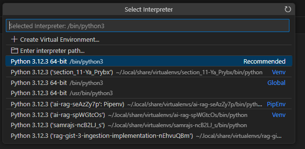

# RAG

This example show how RAG is implemented using LangChain and some open source models in Ollama.

### Prerequisites

* Ollama should be installed locally. Please refer the following link https://ollama.com/download for installing Ollama.
* Python 3 and Pipenv are installed. Pipenv is used as package manager and to manage virtual environment

### Set up
Once Ollama is installed, please execute the following commands to pull the models used in this demo.

```console
$ ollama pull llama3.2
$ ollama pull znbang/bge:small-en-v1.5-q8_0
```

Run the following commands to initialize project. It creates the environment and installs the required libraries.

```console
$ git clone https://github.com/samrajs/ai-rag.git
$ cd ai-rag
$ pipenv install
Creating a virtualenv for this project...
Pipfile: /home/samrajs/temp/ai-rag/Pipfile
Using /usr/bin/python3 (3.12.3) to create virtualenv...
⠸ Creating virtual environment...created virtual environment CPython3.12.3.final.0-64 in 216ms
  creator CPython3Posix(dest=/home/samrajs/.local/share/virtualenvs/ai-rag-seAzZy7p, clear=False, no_vcs_ignore=False, global=False)
  seeder FromAppData(download=False, pip=bundle, via=copy, app_data_dir=/home/samrajs/.local/share/virtualenv)
    added seed packages: pip==24.0
  activators BashActivator,CShellActivator,FishActivator,NushellActivator,PowerShellActivator,PythonActivator

✔ Successfully created virtual environment!
Virtualenv location: /home/samrajs/.local/share/virtualenvs/ai-rag-seAzZy7p
Pipfile.lock (d074a4) out of date, updating to (50de69)...
Locking [packages] dependencies...
Building requirements...
Resolving dependencies...
✔ Success!
Locking [dev-packages] dependencies...
Updated Pipfile.lock (23e4afed66971cded6bdae786b0411a0103aab51b35858f673720f6c7050de69)!
Installing dependencies from Pipfile.lock (50de69)...
To activate this project's virtualenv, run pipenv shell.
Alternatively, run a command inside the virtualenv with pipenv run.
```

Please note down the name of the directory shown in "Virtualenv location:". In my case, it is "/home/samrajs/.local/share/virtualenvs/ai-rag-seAzZy7p".

## Demo
### Set up VS Code

Since I am using VS Code in WSL, I open the project in VS Code by execuing the following command.

```console
$ code .
```

We need to set the correct interpreter for executing python code. Press Ctrl+Shift+P and select "Python: Select Interpreter".


In the shown interpreters, select the one with the same name as the one from the set up section. In my case, I select the following, since it is the one created while executing "pipenv install".



We are good to go.

### Embedding

During the embedding process, we split the file resume.txt, create embeddings with the help of the model "znbang/bge:small-en-v1.5-q8_0" and store it in the vector DB FAISS. 


Open the file "ingestion.py" and run it. It saves the embeddings in the folder "faiss_index_react".

### RAG

In this step, question is sent to vector DB to do a similarity search to find the relevant chunks for the question. The question and its relevant chunks are then sent to LLM. The process looks like as below.


Open the file "rag.py" and execute it. The question "when is Hayden Smith available?" is hardcoded in the code. You get the following result

```console
According to the information provided, Hayden Smith is available:

* Monday to Friday: 4:30pm - 10:00pm (up to 20 hours per week)
* Saturday and Sunday: 8:00am - 11:00pm (up to 20 hours per week)
```
You can play around by changing the question and executing "rag.py".